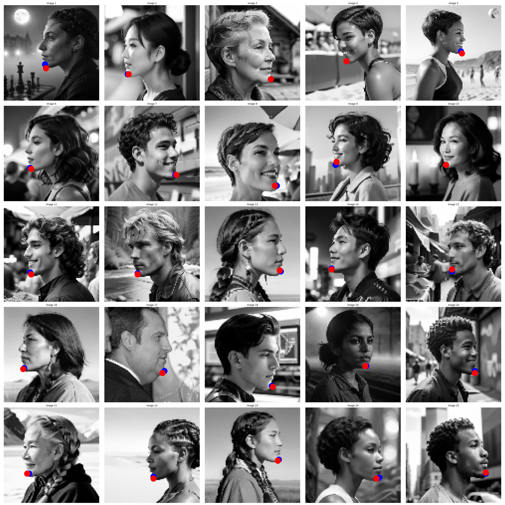
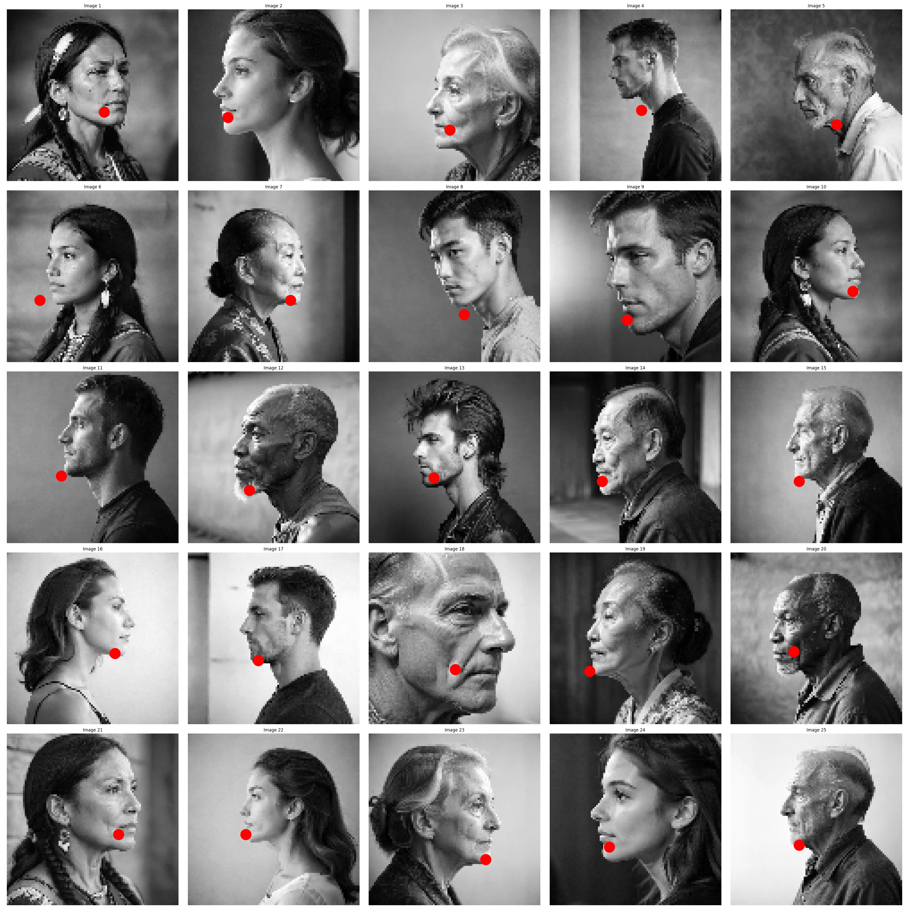

This is a project I worked on over the summer when I was first learning about neural networks; the directory was bloated with tons of testing and oneoff scripts so I am cleaning it up and putting up a more barebones version here.

Test Set images have not been seen before whatsoever, of course. 
The model clearly has generalized quite strictly to the types of images presented in training: The nearly 90 degree angle side profile view of people, showing poor generalization to other profile types. No doubt the underrepresentation of data in the training set of more realistic profiles plays a significant role, but perhaps also the simple 3 layer convnet + batchnorm + relu has low representation power, or perhaps not. I'll need to learn more in the future to optimize networks like this. Of course, one could use a pretrained resnet and either freeze early/mid layers of the network or give seperate learning rates, very low LR to the main resnet, with a normal LR to the regression head. One could also of course try other variants like heatmap regression which seem to work well here, as 2 coordinate regression from all that data in the final linear layers might be doing too much work for their size. But the point here was to try to train something from scratch and see how it performs..
